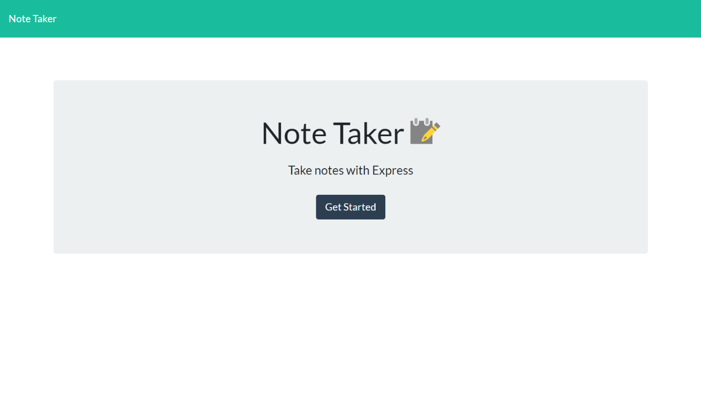
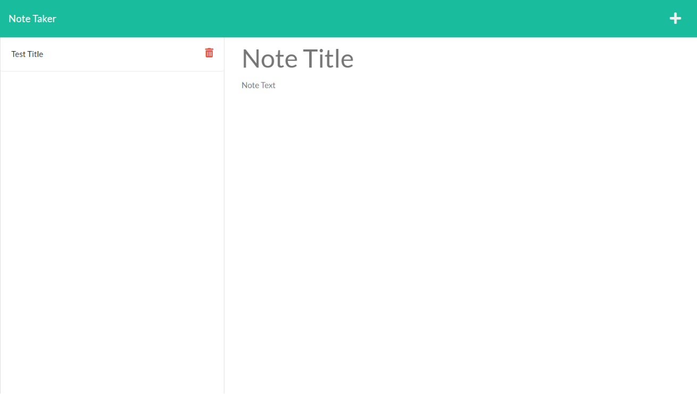
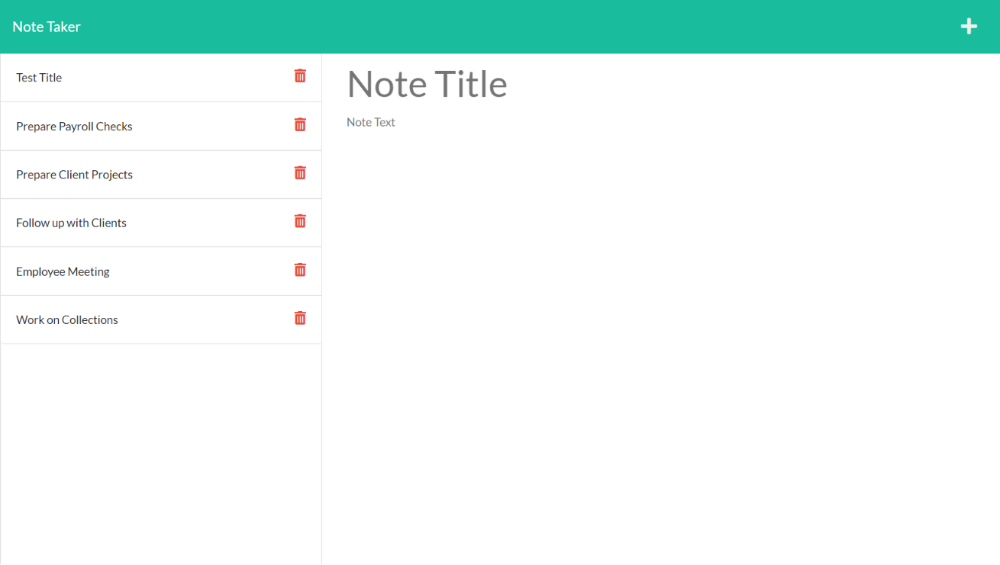
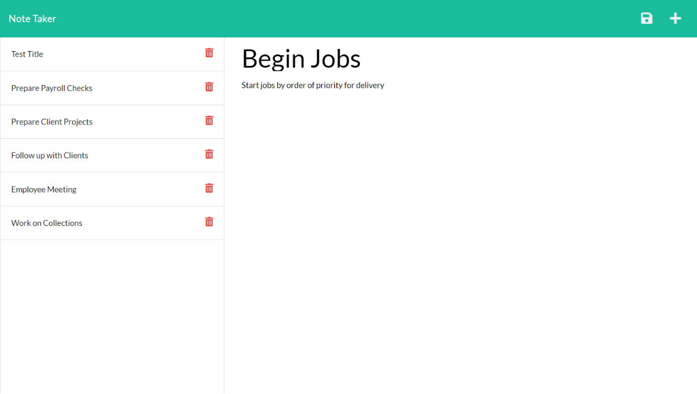

# Note Taker

## Licensing:

## Description:

This app called Note Taker is design to allow the user to have a place to organize and keep notes on thoughts and tasks that they want to complete or accomplish. When opening the app you are taken to a landing page with a link to the note page. When on the notes page the user is able to enter their notes on the right-hand column. When done entering the note the user is able to save the note by clicking on the disk icon in the upper right corner of the top bar and it will be stored in the left-hand column to recall at a later time. When the user wants to add an additional note they simply click on the plus icon in the upper right hand corner and enter their information in the right-hand column. When the note has been completed or accomplished the user simply clicks on the trash can beside the title of the note in left-hand column and the note is deleted.

## Heroku and Github links:

https://note-takerbm.herokuapp.com/

https://github.com/bilcon/note-taker

## Sceen shots of Landing Page, Note Pages

